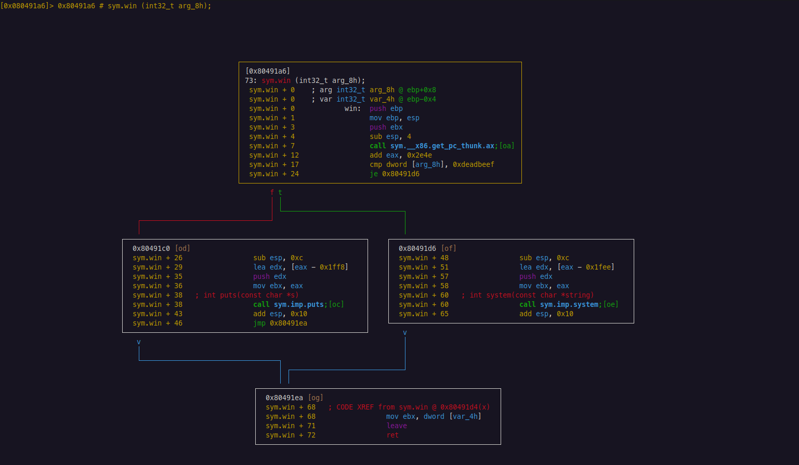

# Graph Mode

Graph Mode is a powerful tool for analyzing control flow. This mode allows us to visualize the control flow of a binary in a flowchart. This is useful for understanding how the binary works and how to solve challenges.


Graph Mode is **not** Visual Mode.


To enter Graph Mode, use the `VV` command (or `V` inside Visual Mode).  Use `q` to leave Graph Mode.

## Graph Mode Views

There are 5 views in Graph Mode. These are:
* Graph View - The main view that shows the flowchart.
* Graph View + Opcodes - Graph View, showing the address of each instruction.
* ESIL - *Evaluable Strings Intermediate Language*. This is a language that `radare2` uses to emulate instructions.
* ESIL + Comments - ESIL, showing the comments for each instruction.
* Overview - Shows the offsets and primary function calls.


Although this guide doesn't cover ESIL (yet!), it can be a rather useful tool. It's pretty intuitive to understand, and it's useful for understanding how instructions work.


The most common view used is *Graph View + Opcodes*.  Use the `p` shortcut to cycle through views, and `P` to cycle in reverse.

Graph Mode is very useful for understanding branching. Since Graph Mode can only show one function at a time, it can be annoying to traverse across several function calls. This tool is more useful for static analysis and reverse engineering.

Use the `V` command while inside Graph Mode to switch the Graph Mode layout. The other layout shows snippets of cross-references from the current function. This is less useful than the default layout, but it's still a useful tool to have.

## Graph Mode Commands

Graph Mode's commands are a bit different from the other modes. These commands are:
* $$\uparrow\,\downarrow\,\leftarrow\,\rightarrow$$ - Shift the view around.
* `Tab` - Move to the next node.
* `Ctrl +` / `Ctrl -` - Zoom in/out.
* `g<identifier>` - Seek to the given identifier.
* `u` - Undo the last seek maneuver.
* `s`/`S` - Step in/over the current instruction.

To view the help command window, use the `?` shortcut.