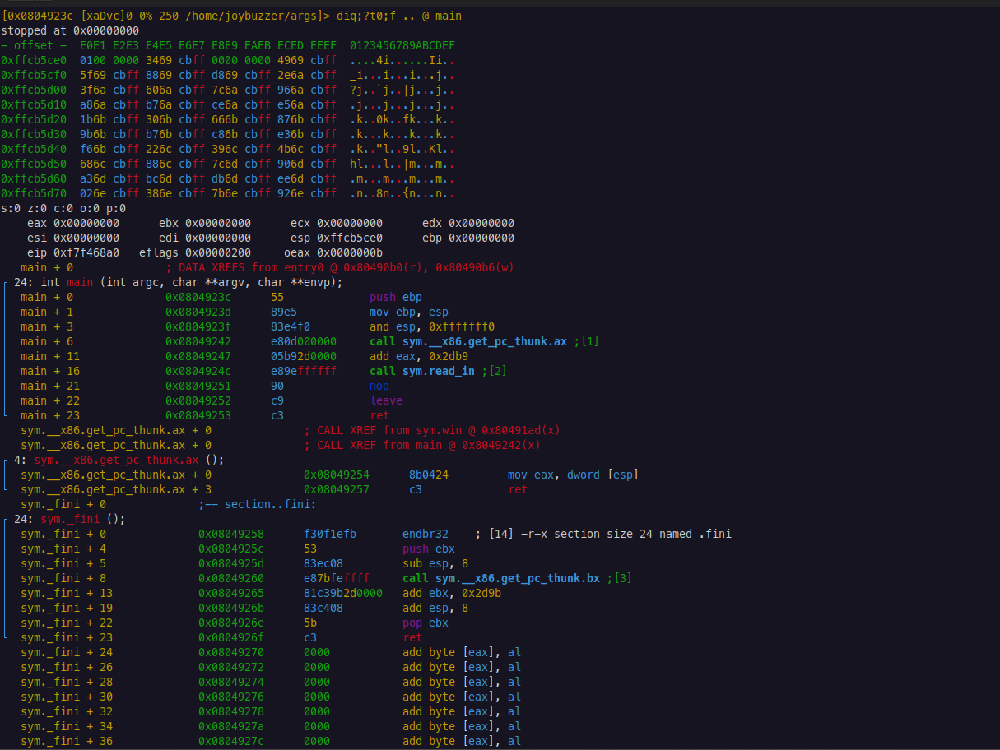

# Radare2 Visual Mode

Visual mode is a user-friendly alternative to the command-line that offers a variety of visualization features. This allows the user to view, debug, and run the binary in a format that is easier to read.  This is mostly equivalent to `gdb`'s GEF plugin, but you directly interact with the UI rather than the UI responding to command-line arguments.

Visual mode overrides a few command-line functionalities so it's important to discuss the Visual mode equivalents.

To enter Visual mode, use `V`.  To quit Visual mode, use `q`.

## Visual Mode Views
There are five views in Visual mode. These are:
* `x`: Hexadecimal view
* `a`: Disassembly listing
* `d`: Debugger View
* `v`: Visual colors
* `c`: Cursor view

The most useful view is the **Debugger view**.  This view shows us the stack, registers, and disassembly.  We can move around the binary via seeking and stepping.


### Debugger View
To quickly access debugger view, use `Vpp` from the command-line. This opens the debugger view directly.


The next section will discuss how to navigate Visual Debugger Mode and how to use it to solve challenges.