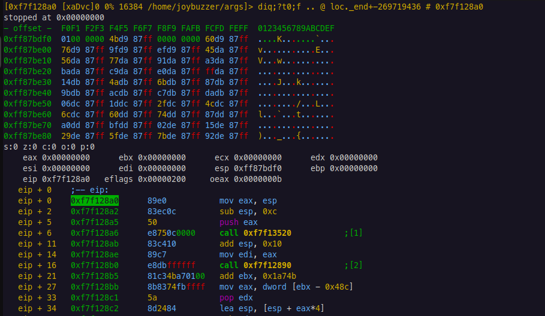
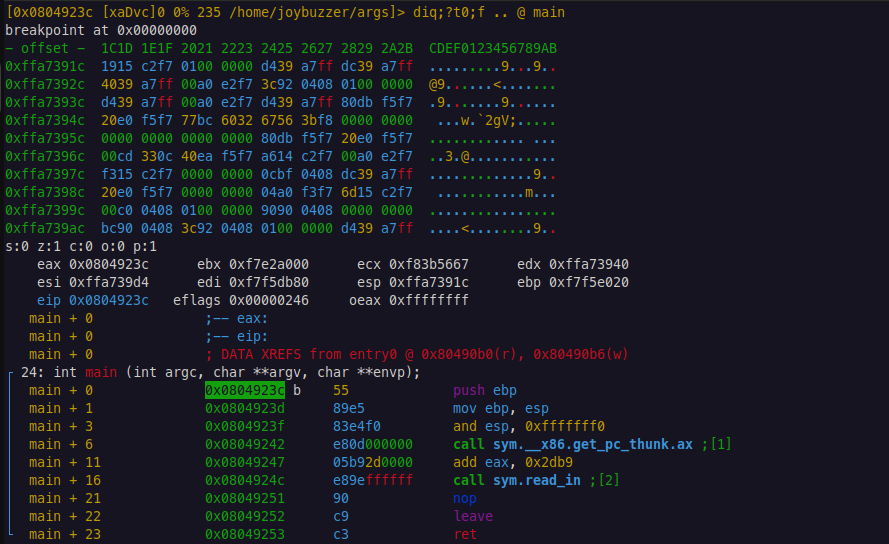
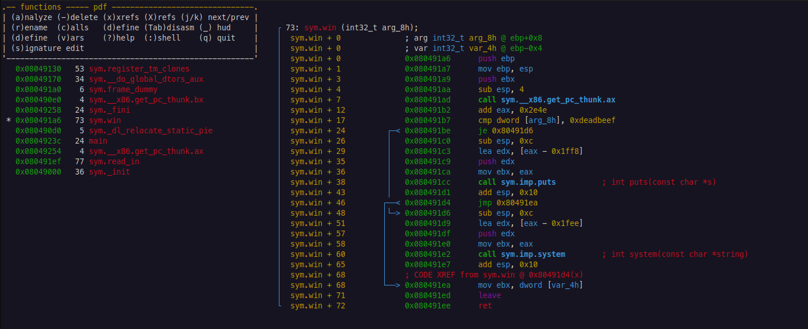

# Analysis with Visual Mode

Using Visual Mode, we can more easily perform static and dynamic analysis on a binary. This section will discuss two modes that are commonly used to analyze functions and then debug the binary.

## Visual Debugger Mode

Visual Debugger Mode is an immensely-powerful tool for doing static and dynamic analysis on a binary. This mode shows us the instructions, stack, and registers while at a seek address.  We can also use this mode to run the binary and debug it.

### Navigation

Visual Debugger Mode offers a few ways to navigate the binary. Below are the standard navigation commands for Visual Debugger Mode.  These commands directly influence the current seek address.

* $$\uparrow$$ / `j` - Move the seek address forward one instruction.
* $$\downarrow$$ / `k` - Move the seek address back one instruction.
* $$\leftarrow$$ / `h` - Decrease the seek address by one byte.
* $$\rightarrow$$ / `l` - Increase the seek address by one byte.


The most common way to navigate is to use `j` and `k` to move between instructions.  Moving one byte at a time isn't very useful.


There are a few other navigation commands that are useful. These are:

* $$.$$ - Seek to `$eip`
* `c` - Show / hide the cursor. This is useful for labelling commands like comments.
* `Enter` - Seek into the current function. This is useful for navigating across the binary and resolving functions.
* `u` - Undo the last seek maneuver. This is used in conjunction with `Enter` to return to the calling function.
* `g` / `G` - Seek to the beginning / end of the binary.
* `x` - Show cross-references to the current seek address. This is useful for finding functions that call the current function.


When you use the `.` command, references will be renamed in terms of `eip`.  Using the `s` command to move elsewhere resets this.



### Entering Commands

When inside Visual Debugger Mode, use the `:` command to open the command line. Like Vim, this opens a small command-line at the bottom of the window to enter commands.

Once you enter a command, another command-line shows to enter another command.  To exit this, use `Enter` again to leave the command line environment.


The Visual Debugger Mode frame will not reset until the command line is exited.  Therefore, when using commands like `s` that actively change location, ensure you exit the command line to register the new location.


### Dynamic Analysis

Unfortunately, we don't have a shortcut to automatically set breakpoints in Visual Debugger Mode. However, using the `:` command, we can set breakpoints using the `db` command.  We also don't have a shortcut to continue to this breakpoint, so we use `:dc` to continue to the breakpoint.

Once we do this, we will see our instruction pointer at the start of `main`.

We can use the following shortcuts to step through the binary:
* `s` - Step *into* the current instruction.
* `S` - Step *over* the current instruction.

We can use these to quickly step through the binary and watch the registers and stack.


My current version of `radare2` freezes every time I step over a `gets` instruction.  I'm not sure why this is. The only mitigation I have found is to close Visual Debugger Mode before stepping over this instruction.


## Visual Code Analysis

Visual Code Analysis is a somewhat-hidden feature of Visual Mode. This mode mimics using `pdf` on the command line to show us disassemblies for all functions. 

To enter this mode, use `Vv` from the command line, or press `v` from anywhere inside Visual Mode.

You can use the up and down arrows (or `j` and `k`) to navigate between functions. You can use the `Enter` key to seek to that function.

There is a lot of functionality within this pane to modify functions. However, we don't cover write mode in this guide.