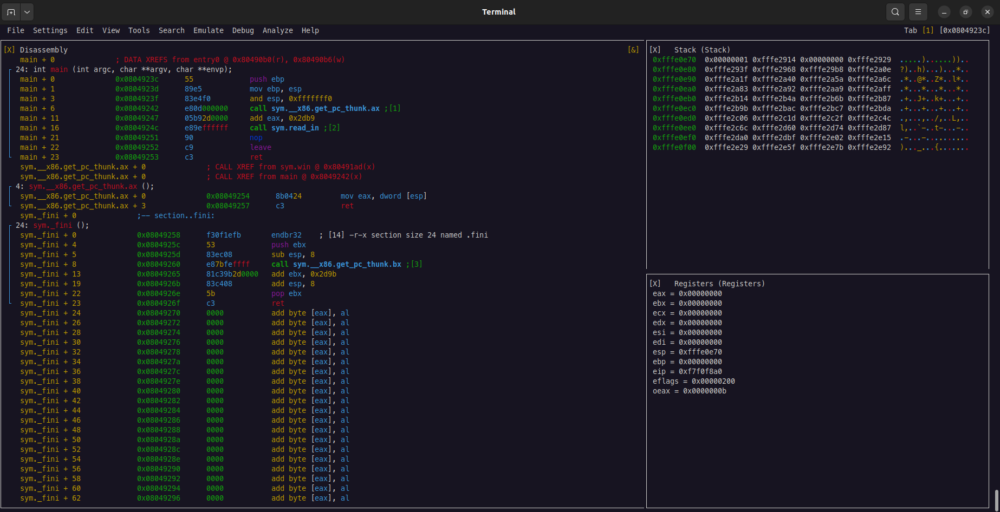

# Visual Panels

Visual Panels is probably the most useful feature in Visual Mode. This mode allows you to view multiple panels at once, which is extremely useful for static and dynamic analysis. 

Use the `V!` command to open Visual Panels Mode, or `!` anywhere inside Visual Mode to open Visual Panels.  Use `!` again to exit Visual Panels Mode.

<div align="center">

</div>

## Adding new Panels

Visual Panels is interactable with both the mouse and keyboard.  The *View* tab shows the available panels. Clicking one of the panels will **split the current panel vertically** to add the new panel.

To manually split the panel, use the following shortcuts:
* `|` - Split the current panel vertically.
* `-` - Split the current panel horizontally.
* `X` - Close the current panel.

To navigate between panels, use the following shortcuts:
* $$\uparrow\,\downarrow\,\leftarrow\,\rightarrow$$ - Navigate the current panel.
* `Tab` - Move to the next panel.
* `Shift + Tab` - Move to the previous panel.
* `p` - Move the current panel to the next panel.
* `P` - Move the current panel to the previous panel.
* `Enter` - Enters Zoom mode, which hides the other panels.

## Saving and Loading Layouts
You can save your custom layout by using the *Save Layout* option from the *File* menu, or by running:
```nasm
> v= test
```

`test` represents the name you want to give your layout.

To open a saved layout, pass the name of the parameter to `v`:
```nasm
> v test
```

More information can be found via `v?`.