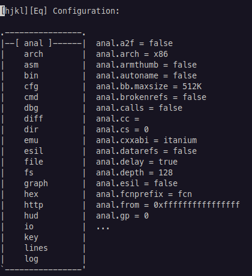
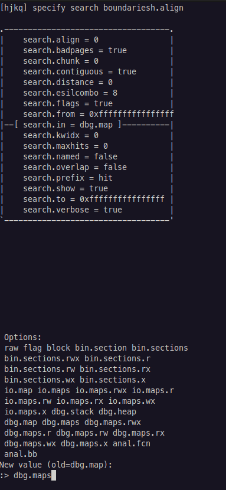

# Editing Configuration: The e Module

The `e` module is a simple module that allows you to edit the configuration of the `radare2` debugger. There are many options to be configured; we will cover the most useful ones.


#### Listing Configuration Options

You can list the configuration options with `e??`.

You can list configuration options for a specific namespace using `e <namespace>.` There are several namespaces, including `anal`, `asm`, `cfg`, `dbg`, and `io`,


## Common Configuration Options

### Assembly: The `asm` Namespace

#### Architecture: `asm.arch`

The binary automatically defines the arch. However, you can change the architecture. This feature is more useful for binaries where the architecture is not obvious, like shellcode files.

#### Syntax: `asm.syntax`

This command is used to change the syntax of the disassembly output. The default is `intel`, but you can change it to `att` or `nasm`.

#### Symbols: `asm.symbols`

This command shows the symbol names for each line in Visual Mode. This is useful because the symbol names for instructions are the function plus offset, which is the only way to get that information. This is one I always have enabled (it is disabled by default).

### Configuration: The `cfg` Namespace

#### Endian: `cfg.bigendian`

You can change the endianness of the binary using this configuration. Like `asm.arch`, this is not very useful for provided binaries but is useful for shellcode files.

#### Newtab: `cfg.newtab`

The `newtab` command is used to display help messages along with command names during tab completion. This is a boolean variable defaulted to `false`. Since I don't often need help messages _anymore_, I leave this off; however for new users, this is a useful feature.

### Screen: The `scr` Namespace

#### Seek: `scr.seek`

This variable accepts an expression or register to seek when opening a file. When the file opens, `radare2` will automatically seek to this address.

A useful expression to use is `main`, which will seek to the `main` function.

#### Scrollbar: `scr.scrollbar`

This variable controls whether the scrollbar is displayed in Visual Mode. It is an integer that accepts either `1` (right side), `2` (top), or `3` (bottom).

#### UTF-8: `scr.utf8`

This setting provides the option to use UTF-8 characters instead of ANSI. This is a boolean variable defaulted to `true`. UTF-8 characters are more visually appealing, but ANSI characters are more compatible with terminals.

### Search: The `search` Namespace

#### Search In: `search.in`

The `search.in` setting depicts the default location that `radare2` will search for data. The default is `dbg.map`, which is the current map of the debugger.

I have found it is most useful to switch this to `dbg.maps`, which will search all maps in the debugger. This will tell `radare2` to search the entire binary for data.

### Stack: The `stack` Namespace

#### Stack Size: `stack.size`

`stack.size` is responsible for the number of bytes shown on the stack in Visual Debugger Mode. The default is four lines, each with `0xF` bytes (totaling `64` bytes).

I prefer to have ten lines, which means I set `stack.size` to `160`.


#### My Configuration

Below is the configuration file I currently use. These are my _permanent_ configuration settings; there are some settings I might change for single uses.

```nasm
$ cat ~/.radare2rc
e stack.size = 160              ; display 10 lines of stack
e search.in = dbg.maps          ; search all memory regions
e asm.symbol = true             ; show line symbols (aka offsets)
```


## Using Visual Mode

Visual mode offers a nice GUI to edit the configuration options. To enter configuration in visual mode, use `Ve`.

<div align="center">



</div>

We use the arrow keys to navigate the window, and the `Enter` or the Right Arrow key to select an option.

Below is an image changing the configuration for `search.in`, which defaults the sections of memories that `radare2` will search for data. Visual Mode tells us the available options for this configuration.

<div align="center">



</div>

Use `q` to exit Visual Mode.
